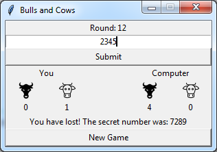

# BullsCowsGui
> This is a game based on my previous bulls and cows project
* What is bulls and cows? Find more info here: https://en.wikipedia.org/wiki/Bulls_and_Cows
* The main task is to find out the randomly generated 4 digit number. The player is competing against the computer. The one who finds the number earlier becomes the winner
* The GUI is written in tkinter
* The code has been tested on windows and raspbian os
* The original console version was written at the beginning of 2017 (when my knowledge of Python was much worse :)).
* The original code can be found here: https://github.com/patex1987/BullsAndCowsGame

## Installation

* works under python 3
* tkinter has to be installed
* More information needs to be added later
* To run the game, run MainGame.py

## Development setup

To be added later

## Todo

* I just simply reused some of the code from my previous Bulls and Cows project. BullsCowsComputerLogic.py - contains these codes. This has to be rewritten, as it is really non-pythonic (was one my first Python projects). What I mean by non-pythonic - naming conventions, coding style, algorithms, etc. Very poor quality, but it works

## Release History

To be added later

## Meta

Gabor Patassy – patex1987@gmail.com

[https://github.com/patex1987](https://github.com/patex1987)

## Contributing

To be added later
